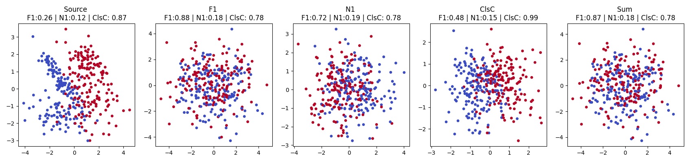
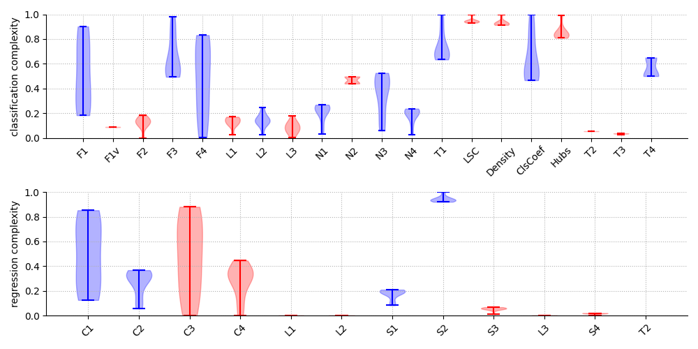

# Transforming Datasets to Requested Complexity with Projection-based Many-Objective Genetic Algorithm

##### Abstract:
The research community continues to seek increasingly sophisticated synthetic data generators that can reliably assess the limitations and strengths of methods. This work aims to increase the availability of datasets that involve a wide range of problem *complexities* by proposing a *genetic algorithm* that optimizes a set of *problem complexity measures* for *classification* and *regression tasks towards a specific target. For the purpose of classification, a set of 10 complexity measures was selected, and for the regression tasks -- 4 measures that show promising optimization abilities. Performed experiments verified that the proposed genetic algorithm can produce datasets at various levels of difficulty by transforming synthetically generated datasets towards target *complexity* values with linear feature projections. The experiments evaluating state-of-the-art classifiers and regressors showed the relationship between the difficulty of the generated data and the recognition quality.

### Evolutionary Projection-based Complexity Optimization (EPCO)

- The EPCO is implemented in `EPCO.py`.
- Minimal processing example can be found in `MPE.ipynb` -- where the EPCO optimizes *F1*, *N1* and *ClsCoef* measures.
- The ranges of used measures (10 for classification task and 4 for regression) can be found in `ranges.py`.

Result of processing example:

### Selected measures
| **Task**         | **Acronym** | **Measure**                                       | **Min** | **Max** |
| ---------------- | ----------- | ------------------------------------------------------ | ------: | ------: |
| *Classification* | F1          | *Maximum Fisher’s discriminant ratio*                  |    0.20 |    0.90 |
|                  | F3          | *Maximum individual feature efficiency*                |    0.45 |    1.00 |
|                  | F4          | *Collective feature efficiency*                        |    0.00 |    0.85 |
|                  | L2          | *Error rate of linear classifier*                      |    0.05 |    0.25 |
|                  | N1          | *Fraction of borderline points*                        |    0.05 |    0.30 |
|                  | N3          | *Error rate of NN classifier*                          |    0.10 |    0.50 |
|                  | N4          | *Non-linearity of NN classifier*                       |    0.05 |    0.30 |
|                  | T1          | *Fraction of hyperspheres covering data*               |    0.60 |    1.00 |
|                  | ClsC        | *Clustering Coefficient*                               |    0.45 |    1.00 |
|                  | T4          | *Ratio of the PCA dimension to the original dimension* |    0.50 |    0.65 |
| *Regression*     | C1          | *Maximum feature correlation to the output*            |    0.10 |    0.90 |
|                  | C2          | *Average feature correlation to the output*            |    0.00 |    0.40 |
|                  | S1          | *Output distribution*                                  |    0.10 |    0.25 |
|                  | S2          | *Input distribution*                                   |    0.90 |    1.00 |

The measures were selected based on preliminary experiment (`Experiments/e0_individual_clf.py` and `Experiments/e0_individual_reg.py`). 

Result of preliminary experiment:

### Repository contents

- Examples -- examples for visualization of the projection results and optimization process.
- Experiments -- experimental code, results and visualizations.
    - `e0` -- preliminary single-criteria experiment for measure and range selection.
    - `e1` -- many-criteria optimization with 10 classification and 4 recgression complexity measures.
    - `e2` -- experiments evaluating the recognition quality.
